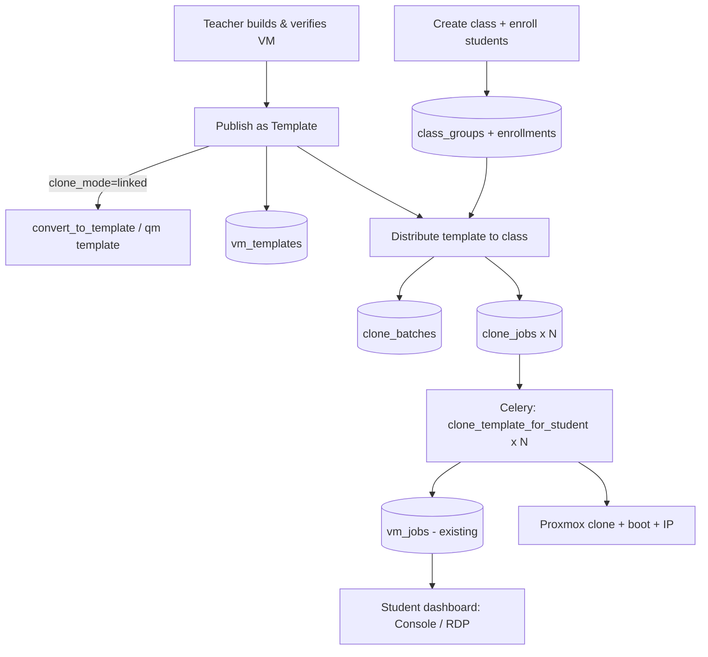

# Clone-from-Template — Architecture & Design

> **Status:** Proposed (awaiting build approval)
> **Author:** Sprint 5 design
> **Date:** 2026-05-26
> **Feature:** Teacher-built VM templates → bulk-cloned to a class of students

---

## 1. Problem & Goal

**Problem.** In a lab, every student burns the first 20–30 minutes installing and
configuring required software on their own laptop. It works on some machines,
fails on others, and the teacher cannot start until *everyone* is ready. The
environment is inconsistent and class time is wasted.

**Goal.** A teacher pre-bakes a VM **once** (installs the app, configures it,
verifies it runs), saves it as a **template**, then **distributes one clone per
student** in a single action. Each student gets an identical, ready-to-use VM
(OS + app already running) accessible instantly via the existing console (ttyd)
or remote desktop (Guacamole).

This is the same platform being handed to the university for GPU-backed ML VMs —
clone-from-template lets a professor stand up a whole class's worth of identical
GPU environments in seconds.

---

## 2. Key Insight — cloning already exists

The platform already clones on every provision. We are **exposing and
generalising** an existing primitive, not inventing one:

| Existing piece | Location | Role in this feature |
|---|---|---|
| `clone_vm(template_vmid, new_vmid, name, node)` | `proxmox_client.py:554` | The clone primitive. **Currently full-clone only** (`"full": 1` hardcoded at L586). |
| `get_next_vmid()` | `proxmox_client.py:320` | Allocates a fresh VMID per clone. |
| `get_clone_template_vmid(os_choice)` | `proxmox_client.py:147` | Maps `ubuntu-22.04`→9000, `windows-11`→9001 today. |
| `update_vm_config(vmid, cores, memory)` | `proxmox_client.py:455` | Apply per-clone specs. |
| `provision_vm` Celery task | `vm_tasks.py:54` | clone → configure → boot → poll IP → store credentials. |
| `create_vm_job(...)` | `database.py:434` | Creates the `vm_jobs` row students already see. |
| `check_daily_quota(user)` | `vm_routes.py:103` | Quota gate — **bypassed** for teacher-distributed clones. |

**Design consequence:** cloned student VMs land in the **existing `vm_jobs`
table**. The student dashboard, console, RDP, expiry, and audit logging all work
unchanged. The new tables only add *template / class / batch lineage* on top.

---

## 3. Data Model

All new tables go in the **existing PostgreSQL** DB via `init_db()`
(`CREATE TABLE IF NOT EXISTS`, matching the established schema-on-startup style).

### 3.1 Entity overview

```
users ──┐                              ┌── vm_templates (teacher's golden VM)
        │ owner                        │
        ├──< vm_templates >── source ──┘
        │
        ├──< class_groups (a class, owned by a teacher)
        │        │
        │        └──< class_enrollments >── student ──> users
        │
        └── clone_batches (one "distribute template X to class Y")
                 │
                 └──< clone_jobs (one per student) ──> vm_jobs (the actual VM)
```

### 3.2 DDL (proposed)

```sql
-- A teacher-published, frozen golden VM that can be cloned.
CREATE TABLE IF NOT EXISTS vm_templates (
    id              SERIAL PRIMARY KEY,
    owner_id        INTEGER NOT NULL REFERENCES users(id),
    name            TEXT NOT NULL,
    description     TEXT,
    source_vmid     INTEGER NOT NULL,          -- Proxmox VMID of the golden VM
    os_choice       TEXT NOT NULL,             -- reuse OS_Choice vocabulary
    clone_mode      TEXT NOT NULL DEFAULT 'full'  -- 'full' | 'linked'  (per-template choice)
                    CHECK (clone_mode IN ('full','linked')),
    -- default specs applied to each clone (teacher can still override at distribute time)
    default_cpu     INTEGER NOT NULL DEFAULT 2,
    default_ram_mb  INTEGER NOT NULL DEFAULT 2048,
    status          TEXT NOT NULL DEFAULT 'draft'  -- draft | published | archived
                    CHECK (status IN ('draft','published','archived')),
    created_at      TIMESTAMPTZ NOT NULL,
    updated_at      TIMESTAMPTZ NOT NULL
);

-- A reusable class / batch of students, owned by a teacher.
CREATE TABLE IF NOT EXISTS class_groups (
    id          SERIAL PRIMARY KEY,
    owner_id    INTEGER NOT NULL REFERENCES users(id),
    name        TEXT NOT NULL,                 -- e.g. "ML-Batch-2026"
    description TEXT,
    created_at  TIMESTAMPTZ NOT NULL
);

-- Which students belong to which class (many-to-many).
CREATE TABLE IF NOT EXISTS class_enrollments (
    id          SERIAL PRIMARY KEY,
    class_id    INTEGER NOT NULL REFERENCES class_groups(id) ON DELETE CASCADE,
    student_id  INTEGER NOT NULL REFERENCES users(id),
    enrolled_at TIMESTAMPTZ NOT NULL,
    UNIQUE (class_id, student_id)              -- no duplicate enrollments
);

-- One "distribute template X to class Y" action (the parent job).
CREATE TABLE IF NOT EXISTS clone_batches (
    id           SERIAL PRIMARY KEY,
    template_id  INTEGER NOT NULL REFERENCES vm_templates(id),
    class_id     INTEGER NOT NULL REFERENCES class_groups(id),
    initiated_by INTEGER NOT NULL REFERENCES users(id),
    clone_mode   TEXT NOT NULL,                -- snapshot of mode used for this run
    cpu_cores    INTEGER NOT NULL,             -- specs used for this run
    ram_mb       INTEGER NOT NULL,
    total        INTEGER NOT NULL,             -- number of students targeted
    status       TEXT NOT NULL DEFAULT 'in_progress'
                 CHECK (status IN ('in_progress','completed','partial','failed')),
    created_at   TIMESTAMPTZ NOT NULL,
    updated_at   TIMESTAMPTZ NOT NULL
);

-- One clone per student (child of a batch). Links to the real vm_jobs row.
CREATE TABLE IF NOT EXISTS clone_jobs (
    id          SERIAL PRIMARY KEY,
    batch_id    INTEGER NOT NULL REFERENCES clone_batches(id) ON DELETE CASCADE,
    student_id  INTEGER NOT NULL REFERENCES users(id),
    vm_job_id   INTEGER REFERENCES vm_jobs(id),   -- NULL until the vm_job row is created
    status      TEXT NOT NULL DEFAULT 'queued'    -- queued | cloning | done | failed
                CHECK (status IN ('queued','cloning','done','failed')),
    error_message TEXT,
    created_at  TIMESTAMPTZ NOT NULL,
    updated_at  TIMESTAMPTZ NOT NULL
);

CREATE INDEX IF NOT EXISTS idx_clone_jobs_batch    ON clone_jobs (batch_id);
CREATE INDEX IF NOT EXISTS idx_clone_jobs_student  ON clone_jobs (student_id);
CREATE INDEX IF NOT EXISTS idx_enroll_class        ON class_enrollments (class_id);
```

**Audit taxonomy additions** (extend the `audit_action_type_check` CHECK list):
`template.create`, `template.publish`, `template.distribute`, `class.create`,
`class.enroll`, `clone.create`.

---

## 4. End-to-End Flow

```
TEACHER (admin portal)
 ┌────────────────────────────────────────────────────────────────────┐
 │ 1. Build a VM, install the app, configure & verify it runs          │
 │ 2. "Publish as Template"                                            │
 │      POST /api/templates  { source_vm_job_id, name, clone_mode }    │
 │        └─ if clone_mode='linked': proxmox.convert_to_template(vmid) │
 │           (qm template — freezes the source; required for linked)   │
 │ 3. Create a class + enroll students                                 │
 │      POST /api/classes ; POST /api/classes/{id}/students            │
 │ 4. "Distribute to class"                                            │
 │      POST /api/templates/{id}/distribute { class_id, cpu, ram }     │
 └───────────────┬────────────────────────────────────────────────────┘
                 │  creates clone_batch + N clone_jobs (status=queued)
                 │  fans out N Celery tasks (quota BYPASSED)
                 ▼
        ┌──────────────────────────────────────────────┐
        │  clone_template_for_student()   × N students  │  (clone_tasks.py)
        │    vmid = get_next_vmid()                      │
        │    create_vm_job(student_id, vmid, …)          │  → student sees it
        │    clone_vm(source_vmid, vmid, full=mode)      │
        │    update_vm_config(cpu, ram)                  │
        │    start_vm → poll IP → store credentials      │
        │    clone_jobs.status = done ; vm_job_id linked │
        └───────────────┬──────────────────────────────┘
                        │  batch.status rolls up: completed / partial / failed
                        ▼
STUDENT (existing dashboard — no changes needed)
 ┌────────────────────────────────────────────────────────────────────┐
 │ 5. Pre-baked VM appears in "My Instances" → Console / RDP → instant │
 └────────────────────────────────────────────────────────────────────┘
```

### Mermaid (for rendering)



---

## 5. API Surface (new)

| Method | Route | Role | Purpose |
|---|---|---|---|
| `POST` | `/api/templates` | admin | Publish a template from an existing VM (or source VMID). Converts to PVE template if `linked`. |
| `GET` | `/api/templates` | admin | List templates owned/visible. |
| `GET` | `/api/templates/{id}` | admin | Template detail + distribution history. |
| `PATCH`| `/api/templates/{id}` | admin | Update name/desc/specs/status (archive). |
| `DELETE`| `/api/templates/{id}` | admin | Archive/remove template (guard if linked clones exist). |
| `POST` | `/api/templates/{id}/distribute` | admin | Bulk-clone to a class. Body: `{class_id, cpu_cores?, ram_mb?, clone_mode?}`. Returns `batch_id`. |
| `GET` | `/api/clone-batches/{id}` | admin | Live per-student progress of a distribution. |
| `POST` | `/api/classes` | admin | Create a class. |
| `GET` | `/api/classes` | admin | List classes. |
| `POST` | `/api/classes/{id}/students` | admin | Enroll students (by user id list). |
| `DELETE`| `/api/classes/{id}/students/{uid}` | admin | Unenroll a student. |

All admin routes reuse the existing admin auth dependency. Distribution writes
`template.distribute` + per-clone `clone.create` audit entries.

---

## 6. Design Decisions (locked with user)

| # | Decision | Choice | Rationale |
|---|---|---|---|
| 1 | Clone trigger | **Bulk clone to a class** | Matches the lab scenario: teacher distributes to everyone at once. |
| 2 | Clone type | **Per-template** (`full` \| `linked`) | Linked = near-instant + tiny disk for short labs; full = independent for long-lived work. |
| 3 | Storage | **New tables in existing Postgres** | Consistent with raw-psycopg2 setup; clean joins with `users`/`vm_jobs`. |
| 4 | Grouping | **Class/group entity** | Reusable across many labs and templates. |
| 5 | Quota | **Teacher-distributed clones bypass quota** | The whole point is everyone gets one instantly; self-made VMs still gated. |

### `full` vs `linked` — operational notes
- **Full clone** (today's behaviour): independent disk copy. Slower, more storage,
  but template can change/be deleted and students can't affect each other.
- **Linked clone**: shares the template's base disk (only deltas stored).
  Near-instant, tiny storage. **Requirements:** source must be converted to a
  Proxmox *template* (`qm template`) and live on storage that supports linked
  clones (e.g. LVM-thin, ZFS, qcow2 on dir). Template must stay frozen.
- `clone_vm()` gains a `full: bool = True` parameter (param `"full": 1 if full else 0`).

---

## 7. Build Plan (phased)

**Phase 0 — Proxmox primitives** (`proxmox_client.py`)
- Add `full: bool = True` param to `clone_vm()`.
- Add `convert_to_template(vmid, node)` → `POST nodes/{node}/qemu/{vmid}/template`.

**Phase 1 — Schema & models**
- Add 5 tables to `init_db()` + indexes + audit taxonomy values.
- New `models/template.py`: enums + Pydantic (TemplateCreate, ClassCreate,
  EnrollRequest, DistributeRequest, response schemas).
- DB helpers in `database.py` (or a new `db/templates.py`): CRUD for templates,
  classes, enrollments, batches, clone_jobs + rollup query.

**Phase 2 — Celery clone task** (`tasks/clone_tasks.py`)
- `clone_template_for_student(clone_job_id, ...)`: allocate vmid, create vm_job,
  clone (with mode), configure, boot, poll IP, store creds, update clone_job +
  roll up batch status. Reuse logic from `provision_vm`.

**Phase 3 — API routes**
- `routes/template_routes.py`, `routes/class_routes.py`. Register in `main.py`.
- Distribution endpoint fans out one Celery task per enrolled student;
  **skips `check_daily_quota`**.

**Phase 4 — Frontend (admin portal)**
- "Templates" page: list, publish-from-VM modal, distribute modal (pick class,
  override specs, choose mode if template allows).
- "Classes" page: create class, enroll/unenroll students.
- Batch progress view (poll `/api/clone-batches/{id}`).
- API client + hooks mirroring existing `vms.ts` / `use-vms.ts` patterns.

**Phase 5 — Docs & journal**
- New KB file `docs/knowledge/11-clone-templates.md` + link in `00-INDEX.md`.
- Sprint journal entry.

---

## 8. Risks & Open Questions

- **Linked-clone storage compatibility:** if Proxmox storage is LVM (not thin),
  linked clones fail. Detect and fall back to full clone with a clear warning.
- **VMID exhaustion / concurrency:** `get_next_vmid()` called N times rapidly —
  ensure no collisions (allocate sequentially inside the task, or pre-allocate a
  range per batch).
- **Lease/expiry on student clones:** student VMs inherit the 2-hour auto-expire.
  Teacher labs may need a longer/disabled lease — possible per-batch override
  (deferred unless requested).
- **Cleanup:** deleting a class or template should not orphan running clones;
  archive semantics keep history while blocking new distributions.
- **Partial failures:** if 3 of 30 clones fail, batch = `partial`; teacher can
  retry just the failed `clone_jobs`.

---

## 9. Files Touched (summary)

| Layer | File | Change |
|---|---|---|
| Proxmox | `backend/app/proxmox_client.py` | `full` param + `convert_to_template()` |
| Models | `backend/app/models/template.py` | **new** |
| DB | `db/database.py` (or `db/templates.py`) | tables + helpers |
| Celery | `backend/app/tasks/clone_tasks.py` | **new** |
| API | `backend/app/routes/template_routes.py` | **new** |
| API | `backend/app/routes/class_routes.py` | **new** |
| API | `backend/app/main.py` | register routers |
| FE | `frontend/src/api/templates.ts`, `classes.ts` | **new** |
| FE | `frontend/src/pages/admin/Templates*.tsx`, `Classes*.tsx` | **new** |
| Docs | `docs/knowledge/11-clone-templates.md` + `00-INDEX.md` | **new / edit** |
```
